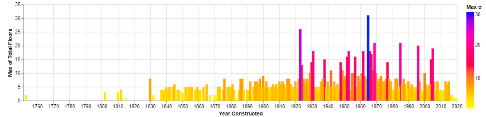

<h1> Homework 10</h1>

 Nick Bernier, Emily Grayburn, Jacob Yoo, Dorothy Wongkarnta
<article>
  <header>
    <h1> Interactive Graph </h1>
  </header>
  <vegachart schema-url="/assets/json/sidebyside.json" style="width: 100%"></vegachart>
  
</article>
<article>
  <header>
    <h1> Static Graph </h1>
  </header>
  
</article>
<article>
  <a href="https://raw.githubusercontent.com/UIUC-iSchool-DataViz/is445_bcubcg_fall2022/main/data/building_inventory.csv">The Data</a>
  <a href="https://github.com/nickbernier2001/nickbernier2001.github.io/blob/main/Yoo-Jacob-Grayburn-Emily-Bernier-Nick-Wongkarnta-Dorothy-Assignment10.ipynb">The Analysis</a>
  
